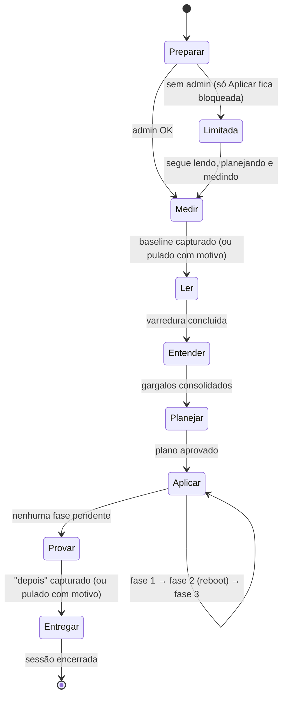

# Arquitetura da Sessão (v5.0 — proposta)

Documento de arquitetura da **Sessão**: a espinha que transforma o ThazzDraco de *painel com sete
nós paralelos* em *procedimento com ordem, estado e prova*.

> **Status:** **todas as fatias entregues (S1–S6).** O trilho está completo de ponta a ponta: cria a
> sessão, mede o antes, lê, entende, planeja (com dependências e conflitos resolvidos), aplica com
> verificação pós-escrita, sobrevive ao reinício, prova o ganho e entrega o relatório. Detalhe de
> cada fatia em §10.
>
> Referências: [ARCHITECTURE](ARCHITECTURE.md) (camadas atuais) · [RULES-SCHEMA](RULES-SCHEMA.md)
> (contrato das regras) · [SCAN-ENGINE](SCAN-ENGINE.md) (detecção) ·
> [GUIA-OTIMIZACAO-GAMING](GUIA-OTIMIZACAO-GAMING.md) (invariantes inegociáveis).

---

## 1. Problema

O app hoje entrega muita capacidade e nenhuma ordem. As sete páginas (Núcleo, Diagnóstico,
Otimizações, Jogos, GPU, Manutenção, Medição) são **independentes**: cada uma tem seu estado, seu
botão e sua tela de resultado. Consequências concretas, todas visíveis no código atual:

| Sintoma | Onde se vê hoje |
|---|---|
| A prova de ganho é opcional e quase nunca acontece | `state.benchBase` / `state.fpsBase` só existem se o usuário clicar em "definir base" (`app.js:1739`, `app.js:1971`) e vivem em `localStorage` |
| O diagnóstico aponta, mas não conduz | `Gargalo.Acao` (`winutil/diagnose.go:23`) carrega `"regra:<id>"`, e a UI só oferece um atalho — não existe fila |
| O usuário decide item a item | `applyIds()` recebe uma lista solta de ids; não existe objeto "plano" em lugar nenhum |
| O reboot quebra o fluxo | `requer_reboot` vira um banner (`#reboot`) e o que vem depois do reinício é responsabilidade do usuário lembrar |
| Nada sobrevive ao fechamento | O único estado durável é `historico.json` (lotes de undo) e os backups |

O motor está bom. Falta o **procedimento**.

---

## 2. Conceitos

| Conceito | Definição |
|---|---|
| **Sessão** | Um atendimento completo em um PC, do preparo à entrega. Tem id, estado durável e uma etapa corrente. |
| **Etapa** | Um dos 7 passos do procedimento. Tem status próprio e pré-requisitos. |
| **Plano** | Lista ordenada e editável de itens que a sessão vai executar. Gerado, não digitado. |
| **Item do plano** | Uma unidade executável: uma regra, um app de inicialização, um tweak de jogo, uma ação manual. |
| **Fase** | Agrupamento de execução dentro do plano: `1` sem reboot · `2` com reboot · `3` manual/BIOS. |
| **Evidência** | Uma medição carimbada com **cenário** (bench + FPS). Só existem duas por sessão: `baseline` e `depois`. |
| **Modo Livre** | As sete páginas atuais, intactas, para o técnico que não quer trilho. |

---

## 3. Máquina de estados

Sete etapas visíveis. **"Preparar" é a etapa 0** — um portão automático, sem tela própria: roda ao
criar a sessão e devolve verde/vermelho.

O portão confere **elevação**, e só. O **ponto de restauração continua sendo criado pelo motor**,
imediatamente antes da primeira escrita (`engine.Apply`) — criar um segundo na abertura da sessão
gastaria a cota diária do Windows sem proteger nada a mais.



### 3.1 Regras de transição

- **Só avança para frente.** Voltar é permitido para *revisar*, nunca para *desfazer* — desfazer é o
  Histórico, que já existe.
- **Pular é permitido, esquecer não.** Qualquer etapa pode ser pulada, mas exige `motivo`, que é
  gravado e **aparece no relatório**. Sem baseline, o relatório diz "sem prova de FPS" — não inventa
  ganho.
- **`Aplicar` exige plano aprovado.** Não existe caminho de aplicação em massa dentro da Sessão sem
  passar por `Planejar`. (No Modo Livre, os botões atuais continuam funcionando como hoje.)
- **Etapa 0 falha ⇒ modo Limitada.** Sem admin, a sessão bloqueia **só `Aplicar`** — a única etapa
  que escreve. Medir, Ler, Entender, Planejar, Provar e Entregar continuam liberadas: montar o plano
  é leitura e decisão, e um PC sem elevação ainda merece saber o que precisa ser feito. Isso
  substitui o nag atual.

### 3.2 Status por etapa

`bloqueada` · `disponivel` · `em-andamento` · `concluida` · `pulada`

---

## 4. Modelo de dados

Pacote novo: **`app/internal/sessao`**. Fica fora de `engine` de propósito — o `engine` continua
sendo motor puro (detect/apply/undo), e a Sessão é a *orquestração* por cima dele. `sessao` importa
`engine` e `winutil`; nunca o contrário.

```go
package sessao

type Sessao struct {
    ID         string         `json:"id"`          // "ses-20260814-153012-9431" (sufixo hex evita colisão no mesmo segundo)
    SchemaVer  string         `json:"schema_ver"`  // "1.0" — versionado (CONVENTIONS.md)
    Criada     string         `json:"criada"`
    Atualizada string         `json:"atualizada"`
    PC         string         `json:"pc"`
    Cliente    Cliente        `json:"cliente"`     // nome opcional; gancho do mini-CRM
    Intencao   string         `json:"intencao"`    // equilibrado|competitivo|streaming|livre
    Etapa      string         `json:"etapa"`       // etapa corrente
    Etapas     []EtapaState   `json:"etapas"`
    Limitada   bool           `json:"limitada"`    // etapa 0 reprovou (sem admin)
    Perfil     map[string]any `json:"perfil"`      // snapshot do hardware no início
    Baseline   *Evidencia     `json:"baseline"`
    Depois     *Evidencia     `json:"depois"`
    Plano      *Plano         `json:"plano"`
    Reboot     RebootState    `json:"reboot"`
    Encerrada  bool           `json:"encerrada"`
}

type EtapaState struct {
    ID     string `json:"id"`      // preparar|medir|ler|entender|planejar|aplicar|provar|entregar
    Status string `json:"status"`
    Quando string `json:"quando"`
    Motivo string `json:"motivo"`  // obrigatório quando pulada ou bloqueada
}
```

### 4.1 Plano

```go
type Plano struct {
    Gerado string      `json:"gerado"`
    Origem string      `json:"origem"`   // "intencao:competitivo" | "livre"
    Itens  []PlanoItem `json:"itens"`
    Resumo PlanoResumo `json:"resumo"`
}

type PlanoItem struct {
    ID          string   `json:"id"`           // id do item no plano
    Tipo        string   `json:"tipo"`         // regra|startup|jogo|limpeza|ferramenta|manual
    Ref         string   `json:"ref"`          // rule_id, nome do app, exe do jogo…
    Titulo      string   `json:"titulo"`
    Porque      string   `json:"porque"`       // "gargalo:hags" | "intencao" | "verde"
    Fase        int      `json:"fase"`         // 1 sem reboot · 2 com reboot · 3 manual
    Ordem       int      `json:"ordem"`
    Tier        string   `json:"tier"`         // verde|amarelo|vermelho
    Impacto     string   `json:"impacto"`      // alto|medio|baixo (vem da regra)
    Selecionado bool     `json:"selecionado"`
    Obrigatorio bool     `json:"obrigatorio"`  // não desmarcável (ex.: ponto de restauração)
    Bloqueado   string   `json:"bloqueado"`    // motivo (dependência/conflito) — "" = livre
    DependeDe   []string `json:"depende_de"`
    ConflitaCom []string `json:"conflita_com"`
    Estado      string   `json:"estado"`       // pendente|aplicando|aplicado|falhou|pulado
    Erro        string   `json:"erro"`
    BatchID     string   `json:"batch_id"`     // lote que aplicou → liga ao historico.json
}

type PlanoResumo struct {
    Total          int            `json:"total"`
    Selecionados   int            `json:"selecionados"`
    PorFase        map[string]int `json:"por_fase"`
    PedemReboot    int            `json:"pedem_reboot"`
    ScoreAtual     int            `json:"score_atual"`
    ScoreProjetado int            `json:"score_projetado"`
}
```

**`BatchID` é a costura com o que já existe.** A Sessão **não** duplica a rede de segurança: quem
guarda snapshot e faz undo continua sendo `engine/apply.go` + `historico.json`. O item do plano só
aponta para o lote que o aplicou.

### 4.2 Evidência e comparabilidade

```go
type Evidencia struct {
    Quando   string         `json:"quando"`
    Score    int            `json:"score"`
    Bench    *BenchSnap     `json:"bench"`     // índice, CPU single/multi, mem GB/s, disco MB/s
    FPS      *FPSSnap       `json:"fps"`       // média, 1% low, 0.1% low, frametime
    Cenario  Cenario        `json:"cenario"`
    Metricas map[string]any `json:"metricas"`
}

type Cenario struct {
    Jogo      string `json:"jogo"`
    Exe       string `json:"exe"`
    Resolucao string `json:"resolucao"`
    RefreshHz int    `json:"refresh_hz"`
    Duracao   int    `json:"duracao_s"`
}

// Chave identifica o cenário para efeito de comparação.
func (c Cenario) Chave() string
```

**Invariante de honestidade:** `baseline` e `depois` só são comparados se `Cenario.Chave()` for
idêntica. Cenários diferentes ⇒ a UI e o relatório mostram **"não comparável"** e o motivo. Um ganho
medido em outro jogo/resolução não é ganho, é ruído — e o produto tem um princípio contra isso.

**A chave é `exe + resolução`** — e só. Duas exclusões deliberadas, decididas na implementação:

- **Taxa de atualização fica fora.** Se a tela passou de 120 Hz para 165 Hz porque a sessão corrigiu
  isso, essa mudança **é o ganho** a mostrar. Recusar a comparação por causa dela seria esconder
  justamente o que o atendimento consertou. Vira observação.
- **Duração fica fora.** Ela afeta a *confiança* da medida, não a identidade do cenário. Diferença
  acima de 20% vira observação ("a captura mais curta tem menos confiança").

### 4.3 Persistência

```
%ProgramData%\ThazzDraco\
  sessoes\<id>.json        # uma sessão por arquivo
  sessao-atual.txt         # ponteiro para a sessão aberta (ou vazio)
  historico.json           # (já existe) lotes de undo
  backups\<id>.json        # (já existe)
```

Escrita **atômica** em toda gravação, reusando `writeFileAtomic` (hoje privado em
`engine/apply.go:130`). Ação: promover para um util compartilhado — sugestão `internal/winutil/fs.go`
— e trocar as duas chamadas atuais.

Gravação acontece a **cada transição de etapa e a cada item concluído**, pelo mesmo motivo do
write-ahead já usado em `persistBatch` (`apply.go:106`): um crash no meio não pode deixar a sessão
mentindo sobre o que foi feito.

### 4.4 Continuidade através do reboot

```go
type RebootState struct {
    Pendente   bool   `json:"pendente"`
    Marca      string `json:"marca"`       // uptime/boot-id de antes do reinício
    VoltarPara string `json:"voltar_para"` // etapa a retomar
}
```

Antes de reiniciar: grava `Pendente=true`, `VoltarPara`, e a marca de boot atual.
Ao abrir o app: se `sessao-atual.txt` aponta para uma sessão com `Reboot.Pendente` **e a marca de
boot mudou**, a UI abre direto em *"Você reiniciou. Vamos medir o resultado."*

**Decisão: sem auto-início.** Nada de `RunOnce`/Scheduled Task por padrão. O binário exige admin pelo
manifesto, então auto-start dispararia UAC no logon — e o projeto já briga com SmartScreen/Defender
(ver [DISTRIBUICAO-CONFIANCA](DISTRIBUICAO-CONFIANCA.md)). Retomar na abertura resolve o problema
real sem gastar confiança.

---

## 5. O planejador

`sessao.GerarPlano(entradas) *Plano` — função **pura** (sem I/O), testável em `sessao/plano_test.go`.

### 5.1 Entradas

| Entrada | Origem hoje |
|---|---|
| Regras + estado detectado | `engine.Scan()` → `ScanResult.Regras` (campo `aplicavel`) |
| Gargalos | `winutil.Diagnose()` → `[]Gargalo` com `Acao` (`"regra:<id>"`, `"pagina:<x>"`, `"manual"`) |
| Inicialização | `/api/inicializacao` |
| Jogos | `/api/jogos` |
| Perfil | `ScanResult.Perfil` |
| Intenção | escolha do usuário → `presets.json` (`equilibrado` 20 · `competitivo` 32 · `streaming` 19) |

### 5.2 Algoritmo

1. **Semear pela intenção.** Os ids do preset entram como candidatos. `livre` semeia todas as regras
   com `aplicavel == true`.
2. **Cruzar com o diagnóstico.** Todo `Gargalo` com `Acao == "regra:<id>"` marca o item com
   `Porque = "gargalo:<id>"`. Gargalo `critico` sem regra correspondente vira item `Tipo: "manual"`
   na fase 3 (XMP na BIOS é o caso clássico).
3. **Descartar o que não cabe.** Regras com estado `aplicado` ou `nao-aplicavel` saem do plano
   (o gate de hardware já foi resolvido no scan — o planejador não reavalia).
4. **Fasear.** `requer_reboot` → fase 2. `modo == "consultivo"` ou `Acao == "manual"` → fase 3.
   Resto → fase 1.
5. **Ordenar dentro da fase** por: origem em gargalo crítico → `impacto` (alto/médio/baixo) →
   `tier` (verde antes de amarelo).
6. **Selecionar por padrão:** `verde` marcado · `amarelo` marcado **apenas** se
   `intencao == "competitivo"` · `vermelho` **nunca** (invariante do guia, não é configurável).
7. **Resolver dependências e conflitos** (§5.4).
8. **Resumir**, incluindo o score projetado (§5.3).

### 5.3 Score projetado — e por que ele é honesto

Reusa **exatamente** a fórmula de `engine/scan.go:107`, com o numerador movido:

```
score_projetado = (aplicados + selecionados_aplicaveis) / (aplicados + pendentes) * 100
```

É a mesma conta do Boost Score, com os itens marcados contados como se já estivessem aplicados.
A UI é obrigada a rotular: **"projeção do Boost Score — não é previsão de FPS."** Previsão de FPS o
app não faz; ele **mede** (etapa `Provar`).

### 5.4 Dependências e conflitos

`rules.json` hoje não expressa relação entre regras. Proposta de dois campos **opcionais** (ausência
= sem restrição, então o arquivo atual continua válido e o `schema_version` sobe uma minor):

```json
{
  "id": "energia.plano-maximo",
  "depende_de": ["energia.plano-alto-desempenho"],
  "conflita_com": ["energia.economia"]
}
```

Regra de resolução no planejador:
- Item cuja dependência não está `aplicado` nem selecionada ⇒ `Bloqueado: "depende de <título>"` e
  desmarcado.
- Dois itens em conflito selecionados ⇒ vence o de maior impacto; o outro recebe
  `Bloqueado: "faz o mesmo que <título>"`.

**Entregue na S4.** A varredura das 61 regras achou menos relações do que a suposição inicial (que
falava em DNS × faxina de rede e no par HAGS/MPO): cruzando o que cada regra **escreve**, nenhuma
delas grava a mesma chave que outra. As relações reais são três — ver §10.5.

---

## 6. API

Todos **POST** (exceto os dois `GET` de leitura), todos sob o token de sessão já existente
(`server.go:257`). Nenhum endpoint atual muda ou some — o Modo Livre depende deles.

| Rota | Corpo | Devolve |
|---|---|---|
| `GET  /api/sessao` | — | `Sessao` atual ou `null` |
| `POST /api/sessao/nova` | `{cliente, intencao}` | `Sessao` (roda etapa 0) |
| `POST /api/sessao/retomar` | `{id}` | `Sessao` |
| `POST /api/sessao/etapa` | `{etapa, acao:"concluir"\|"pular", motivo}` | `Sessao` |
| `POST /api/sessao/evidencia` | `{fase:"baseline"\|"depois", bench?, fps?, cenario}` | `Sessao` |
| `POST /api/sessao/plano/gerar` | `{intencao}` | `Plano` |
| `POST /api/sessao/plano/selecionar` | `{itens:[{id, selecionado}]}` | `Plano` recalculado |
| `POST /api/sessao/aplicar` | `{fase}` | `{ok, execucao_id}` — assíncrono |
| `GET  /api/sessao/status` | — | `{fase, atual, feitos, total, itens[]}` (poll) |
| `POST /api/sessao/encerrar` | `{}` | `Sessao` congelada |
| `GET  /api/sessoes` | — | lista resumida (gancho do mini-CRM) |

**Execução fica no backend, não no JS.** `/api/sessao/aplicar` dispara e retorna; a UI faz poll em
`/api/sessao/status`. É o mesmo padrão já usado por `/api/reparo/*` e `/api/fps/*`, e garante que
fechar a janela no meio não deixe o plano em estado indefinido. Serializado por `s.mu`, como as
demais operações de motor.

### 6.1 Executor de fase

Para cada fase, o executor:

1. Separa os itens selecionados por tipo.
2. `Tipo: "regra"` → uma chamada a `engine.Apply(ids, …)` — **um lote só por fase**, para que o undo
   por lote continue fazendo sentido no Histórico.
3. `startup` / `jogo` / `limpeza` / `ferramenta` → chamam os handlers já existentes.
4. Grava `BatchID` e `Estado` de cada item.
5. **Verifica.** Roda `engine.Scan()` de novo e compara o estado de cada regra aplicada. Se a regra
   não ficou `aplicado`, o item vira `falhou` com
   `Erro: "escrita não persistiu (política de grupo, permissão ou o Windows reverteu)"` — nunca ✓.
6. Persiste a sessão.

O passo 5 é a ideia #7 da lista de melhorias, e cabe aqui porque o `/api/aplicar` **já** devolve um
`scan` novo (`app.js:1240`) — a informação existe, só não é conferida item a item.

---

## 7. Mudanças por arquivo

### Backend

| Arquivo | Mudança |
|---|---|
| `internal/sessao/model.go` | **novo** — structs de §4 |
| `internal/sessao/store.go` | **novo** — load/save atômico, `sessao-atual.txt`, lista |
| `internal/sessao/maquina.go` | **novo** — transições, validação de pré-requisito, pular com motivo |
| `internal/sessao/plano.go` | **novo** — `GerarPlano` (função pura) + resolução de dependências |
| `internal/sessao/executor.go` | **novo** — execução por fase + verificação pós-escrita |
| `internal/sessao/plano_test.go` | **novo** — casos: preset, gargalo crítico, conflito, tier vermelho nunca marcado |
| `internal/server/sessao.go` | **novo** — os 11 handlers de §6 |
| `internal/server/server.go` | +11 `mux.HandleFunc` no bloco de rotas (hoje ~90, linhas 82–166) |
| `internal/engine/apply.go` | `writeFileAtomic` sai daqui e vira util compartilhado |
| `internal/engine/model.go` | `Rule` ganha `DependeDe []string` / `ConflitaCom []string` (opcionais) |
| `internal/engine/assets/rules.json` | `schema_version` sobe; relações mapeadas (fatia S4) |
| `internal/winutil/diagnose.go` | sem mudança de comportamento — o campo `Acao` já é o contrato |

### Frontend

| Arquivo | Mudança |
|---|---|
| `web/sessao.js` | **novo** — trilho, painéis por etapa, poll de execução. Arquivo separado de propósito: `app.js` já tem 3.674 linhas |
| `web/index.html` | novo `<section class="page" id="page-sessao">` com 7 painéis; `<script src="sessao.js">`; entrada "Sessão" no `#mainnav` |
| `web/app.js` | `state.sessao`; `SUBPAGES`/`showPage` aceitam `sessao:<etapa>`; `stopLiveJobs` reconhece os destinos vivos da sessão (`LIVE`, `app.js:486`); toggle **Sessão ↔ Modo Livre** |
| `web/app.css` | estilos do trilho de etapas e das listas do plano |

**Reaproveitamento é requisito, não bônus.** Os painéis das etapas chamam as funções que já existem
— `renderBench()`, `renderFps()`, `renderReco()`, `ruleRow()`, `doScan()`. Se a etapa `Medir`
reescrever a tela de benchmark, o projeto ganhou duas telas de benchmark para manter. Não pode.

---

## 8. UI

```
┌─────────────────────────────────────────────────────────────────┐
│  ① Medir  ─  ② Ler  ─  ③ Entender  ─  ④ Planejar  ─ ⑤ Aplicar  │  ← trilho, sempre visível
│                                    ▲ você está aqui             │
├─────────────────────────────────────────────────────────────────┤
│                                                                 │
│   [ painel da etapa corrente — reusa os componentes atuais ]     │
│                                                                 │
├─────────────────────────────────────────────────────────────────┤
│  ← voltar        pular etapa (com motivo)        avançar →       │
└─────────────────────────────────────────────────────────────────┘
```

- O trilho mostra as 7 etapas com status; concluídas ficam clicáveis para revisão.
- `Planejar` é a tela nova de verdade: lista agrupada por fase, cada item com título, *porquê*
  (o gargalo que o originou), selo de segurança e checkbox. Rodapé fixo com o resumo e o score
  projetado.
- `Aplicar` mostra a fila executando ao vivo (item corrente, feitos/total) e, ao fim da fase 2,
  o convite ao reinício.
- **Modo Livre** continua sendo a navegação atual, alcançável por um toggle no HUD de comando. Nada
  do que existe é removido nesta fatia.

---

## 9. Invariantes

Preservados sem exceção (fonte: [GUIA-OTIMIZACAO-GAMING](GUIA-OTIMIZACAO-GAMING.md)):

1. Ponto de restauração + snapshot por valor antes de qualquer escrita.
2. Undo exato por regra/lote, via `historico.json` — a Sessão **referencia**, não reimplementa.
3. Risco alto (`tier: vermelho`) nunca é selecionado automaticamente, em nenhuma intenção.
4. Consentimento explícito para `requer_consentimento` e para limpeza irreversível.
5. Só dado real. Sem número estimado em lugar nenhum da Sessão.

Novos, introduzidos por este desenho:

6. **Etapa pulada exige motivo, e o motivo entra no relatório.**
7. **Comparação só entre cenários idênticos** — senão, "não comparável".
8. **Aplicado só depois de reler.** Verificação pós-escrita obrigatória (§6.1, passo 5).
9. **A Sessão nunca aplica sozinha.** Só executa plano aprovado explicitamente.

---

## 10. Fatias de entrega

| Fatia | Entrega | Aceite |
|---|---|---|
| **S1 ✅** | Modelo + store + máquina de estados + trilho na UI (sem plano) | Cria sessão, avança/pula com motivo, fecha e reabre o app e a sessão volta na etapa certa |
| **S2 ✅** | Etapas `Medir` e `Provar` com `Evidencia` + `Cenario` | Baseline e depois gravados na sessão; cenário divergente mostra "não comparável" |
| **S3 ✅** | `GerarPlano` + tela `Planejar` + score projetado | Plano gerado a partir de intenção + gargalos, editável, com resumo por fase |
| **S4 ✅** | `depende_de` / `conflita_com` em `rules.json` + resolução | Item com dependência não satisfeita aparece bloqueado com motivo legível |
| **S5 ✅** | Executor por fase + verificação pós-escrita + poll | Fecha a janela no meio da fase e reabre: a sessão sabe exatamente onde parou |
| **S6 ✅** | Continuidade pós-reboot + `Entregar` (relatório da sessão) | Reinicia na fase 2 e o app abre em "vamos medir o resultado" |

S1→S3 já muda a percepção do produto. S5 é o que o torna confiável.

### 10.1 O que a S1 entregou (e o que ela deliberadamente não fez)

**Entregue:** `internal/sessao` (`model.go`, `maquina.go`, `store.go`, `maquina_test.go`),
`internal/server/sessao.go` com 6 rotas, `winutil/fs.go` (`DataDir` + `WriteFileAtomic`, agora
compartilhados com o motor), `web/sessao.js` + estilos + a entrada **Sessão** no HUD.

**Diferenças em relação ao desenho, por ora:**

| Item | Situação |
|---|---|
| `Sessao.Plano`, `.Baseline/.Depois`, `.Reboot` | Fora do struct até S2/S3/S6 — o arquivo em disco não carrega estrutura vazia antes da hora |
| Rotas de plano/evidência/execução | Não existem ainda (5 das 11 de §6) |
| Painel das etapas | Conduz para as telas que já existem (Benchmark, FPS, escanear, Diagnóstico, Otimizações, Relatório) em vez de ter tela própria |
| `Planejar` / `Aplicar` | Dizem na cara que o plano automático e a fila ainda não existem, e mandam para Otimizações |
| Rever etapa passada | É só UI: o campo `Etapa` guarda até onde a sessão chegou e nunca retrocede |

**Testado:** `maquina_test.go` cobre início, bloqueio sem admin, avanço, etapa fora de vez, motivo
obrigatório, pular bloqueada, encerramento pelo fim e encerramento no meio. O fluxo completo foi
exercitado na UI com o servidor headless, incluindo os caminhos de erro (409 sessão duplicada,
405 em rota de escrita, id de sessão com `../`).

### 10.1b O que a S2 entregou

**Entregue:** `internal/sessao/evidencia.go` (+ `evidencia_test.go`),
`internal/server/sessao_medir.go`, `winutil.DisplayModo()`, as rotas `/api/sessao/medir` e
`/api/sessao/fps-pronto`, e as etapas **Medir** e **Provar** com os dois cartões (benchmark e FPS) e
a tabela antes × depois.

**Decisões tomadas na implementação:**

| Decisão | Por quê |
|---|---|
| **Os números nunca vêm do cliente** | `/api/sessao/medir` roda o benchmark no servidor e lê a captura de FPS do gerenciador do PresentMon. Se a UI pudesse mandar valores, "ganho comprovado" viraria o que a tela quisesse |
| Cenário carimbado com **resolução e Hz reais** (`DisplayModo`) | Sem isso o cenário seria o que o técnico lembrasse de digitar |
| Margem de **1%** = "igual" | Anunciar +0,4% como melhoria é o mesmo snake oil que o produto recusa |
| Ressalva fixa no bloco de benchmark | Rodando a bancada **duas vezes seguidas sem mudar nada**, o índice variou +15,6% e o disco +126% (cache do Windows). O bloco agora diz, por escrito, que bancada é indicador e a prova é o FPS no jogo |
| Métricas invertidas (engasgo) | `MaiorMelhor: false` — engasgo caindo de 6,2% para 3,1% é melhoria, e a UI colore certo |
| Bloco incomparável **não devolve métricas** | Se devolvesse, a UI mostraria os números lado a lado assim mesmo. Sem dados, não há como mentir |
| FPS reusa a tela de Medição | Capturar exige escolher o jogo e jogar. A sessão detecta que há captura pronta e oferece "guardar como baseline" — um clique, nenhuma tela duplicada |

**Testado:** 8 testes (jogo diferente, resolução diferente, Hz diferente comparando com observação,
duração diferente, só um lado medido, ruído tratado como igual, piora reconhecida como piora,
métrica invertida). Na UI, com dois benchmarks reais desta máquina: tabela com melhor/igual/pior
(inclusive o "+0,7% = igual"), e o caso "não comparável" (Valorant × Fortnite) mostrando o motivo
com os dois cenários e **nenhuma métrica**.

### 10.2 O que a S3 entregou

**Entregue:** `internal/sessao/plano.go` (planejador puro) + `plano_test.go`, as rotas
`/api/sessao/plano/gerar` e `/api/sessao/plano/selecionar`, `winutil.Gargalos()` (a lista tipada que
antes só existia dentro do mapa do `/api/diagnostico`), e a tela **Planejar** de verdade: itens
agrupados por fase, seleção editável, troca de perfil e resumo com score projetado.

**Decisões tomadas na implementação:**

| Decisão | Por quê |
|---|---|
| **Planejar deixou de exigir admin** (§3.1 atualizado) | Montar o plano é leitura + decisão; não escreve nada. Quem exige elevação é *Aplicar*. Antes, um PC sem admin nem ficava sabendo o que precisaria ser feito |
| O plano lista **tudo que dá para fazer**, não só o preset | Esconder opção é decidir pelo técnico. A intenção decide o que vem **marcado**, não o que aparece |
| Regra que **pede consentimento nunca vem marcada** | Consentimento marcado por padrão não é consentimento. Vale inclusive para a limpeza (que não tem undo) e para `win.onedrive-off`, que está no preset Competitivo |
| **Amarelo só entra pelo perfil** que assumiu esse risco | Fora do preset, amarelo aparece desmarcado |
| Gargalo **crítico manda no impacto** da regra | O rótulo genérico da regra ("baixo") não pode enterrar um item que o diagnóstico mediu como problema real |
| Mapa `consultivaDoGargalo` | O diagnóstico e as regras consultivas se sobrepõem (taxa de atualização, XMP). Sem o mapa, o mesmo trabalho aparecia duas vezes. Ganha o gargalo, que carrega o valor medido. Formalizar isso no schema fica para a S4 |
| Trocar de perfil **pede confirmação** | Regerar descarta as marcações feitas à mão |

**Não entrou:** dependências/conflitos entre regras (S4 — o campo `Bloqueado` viaja mas ninguém o
preenche).

**Testado:** 12 testes cobrindo semeadura por preset, risco alto nunca marcado (nas 4 intenções),
consentimento, intenção livre, regra já aplicada/fora do hardware, gargalo virando motivo, gargalo
sem regra virando item de mão, deduplicação da consultiva, separação de fases e a fórmula do score.
Na máquina real, o plano saiu com 19 itens e pegou 3 gargalos verdadeiros (monitor a 120 Hz num
painel de 165 Hz, 9% livre no C:, 7 jogos num HD mecânico).

---

### 10.3 O que a S5 entregou

**Entregue:** `internal/sessao/executor.go` (+ `executor_test.go`), `internal/server/sessao_exec.go`,
`engine.ApplyRulesProgresso`, `sessao.Transacao`, as rotas `/api/sessao/aplicar`,
`/api/sessao/status` e `/api/sessao/plano/feito`, e a etapa **Aplicar** de verdade: fila ao vivo,
resultado item a item e checklist da fase 3.

**Como a execução é serializada.** A fase roda numa goroutine que segura `s.mu` — o mesmo cadeado de
`/api/aplicar` —, então nunca há duas escritas no sistema ao mesmo tempo. Por isso
`/api/sessao/status` é o **único** handler de sessão que não pega `s.mu`: ele só lê o arquivo, e
precisa continuar respondendo enquanto a fase corre. Toda mutação passa por `sessao.Transacao`
(carrega → altera → grava sob o mesmo cadeado), senão a goroutine e os handlers gravariam por cima
um do outro.

**Decisões tomadas na implementação:**

| Decisão | Por quê |
|---|---|
| **Um `ApplyRules` por fase**, não um por item | Um ponto de restauração e **um lote** no histórico — é o que mantém "desfazer o lote" fazendo sentido. O andamento por item veio de um callback novo (`ApplyRulesProgresso`), não de fatiar a chamada |
| **`aplicado` só depois de reler** | Terminada a fase, o motor varre de novo e confere item a item. Escrita que não persistiu (política de grupo, permissão, Windows revertendo) vira **falhou** com o motivo — nunca um ✓ |
| Execução órfã vira **`interrompida`**, itens viram **`desconhecido`** | Se o app morre no meio, o arquivo fica dizendo "aplicando" para sempre. Na volta, o app reconcilia e admite que não sabe em que pé cada item ficou. Rodar a fase de novo é seguro: o motor pula o que já está aplicado |
| Item de mão **só a pessoa marca** | Quem afirma que entrou na BIOS é o técnico. `/api/sessao/plano/feito` recusa marcar item que o app executa |
| Consentimento é barrado no `IniciarExecucao` | A fase nem começa se houver item que pede confirmação sem `confirmar: true` |
| Sessão ilegível vira **aviso**, não silêncio | Descoberto testando: um arquivo com BOM fazia o app agir como se nunca tivesse havido sessão. Agora o BOM é tolerado e, se ainda assim não abrir, a UI diz que havia uma sessão e não foi possível abri-la |

**Testado:** 6 testes novos (validações do início, consentimento, a tabela de julgamento da escrita
incluindo "não persistiu", contagem + amarração ao lote, reconciliação da execução morta, item de
mão). Na UI: painel da fase com os botões por fase, checklist de mão, recusa de marcar item
executável, guarda de admin, e o **critério de aceite** — execução forjada como "rodando", app
reaberto, reconciliado para "interrompida" com os 4 itens em "desconhecido" e a fase disponível para
rodar de novo.

**Não verificado ao vivo:** a escrita em si. O servidor de teste roda sem elevação (é o que o modo
headless permite), e `Aplicar` exige admin — então o caminho `ApplyRulesProgresso` → registro só foi
exercitado por teste unitário. O código que escreve é o `engine.ApplyRules` de sempre; o que mudou
foi o aviso de andamento em volta dele.

### 10.4 O que a S6 entregou

**Entregue:** `internal/sessao/reboot.go` (+ `reboot_test.go`), `winutil.UptimeSegundos()`, as rotas
`/api/sessao/reiniciar` e `/api/sessao/reboot-visto`, o cartão de reinício no topo do trilho, a etapa
**Entregar** e o **bloco de sessão dentro do relatório imprimível**.

**Como o app sabe que o PC reiniciou.** Pelo **uptime**, não pelo relógio: antes de mandar reiniciar,
a sessão grava o uptime do momento; na volta, se o uptime atual for **menor**, a máquina reiniciou.
Não depende de fuso, de o relógio estar certo, nem de o técnico ter reiniciado na hora que disse que
ia. E o modo de falhar é o seguro: se o app morrer entre gravar e desligar, o uptime da volta será
*maior* e nada é confirmado por engano.

**Decisões tomadas na implementação:**

| Decisão | Por quê |
|---|---|
| **Sem auto-start** (confirmado na implementação) | O binário exige admin pelo manifesto; um RunOnce dispararia UAC no logon, e o projeto já briga com SmartScreen. Retomar quando o técnico reabrir resolve o problema real sem gastar confiança |
| Marcar e reiniciar **numa chamada só** (`/api/sessao/reiniciar`) | Senão existe uma janela em que o app manda reiniciar e morre antes de gravar por que estava reiniciando |
| O cartão de reinício vive **no topo do trilho**, não dentro de uma etapa | É evento da sessão inteira: quem volta do reinício precisa ver isso antes de qualquer outra coisa |
| "Ir para Provar" **não insiste** numa etapa bloqueada | Achado testando: numa sessão sem admin o botão tentava concluir `Aplicar` e recebia o técnico com um erro. Botão de "próximo passo" não pode falhar na cara de quem acabou de reiniciar |
| O relatório entra **no relatório do cliente que já existe** | Reusa o papel imprimível, o logo e o nome do cliente (agora pré-preenchido pela sessão) em vez de criar um segundo relatório para manter |
| O relatório mostra o que **não** foi feito | Etapas puladas com motivo, itens que falharam com a mensagem, itens de mão não marcados, e "não comparável" no lugar da tabela quando o cenário mudou |

**Testado:** 3 testes novos (marcar/confirmar nos dois sentidos, etapa de retorno inválida, "precisa
reiniciar" só depois de uma fase que realmente pediu). Na UI, os três estados do cartão: *pedido mas
não aconteceu* (uptime real maior — o app **não** confirmou por engano), *reiniciou* (uptime menor →
"O PC reiniciou … o passo seguinte é medir o resultado", que é o critério de aceite), e o pós-clique
levando para Provar sem erro. No relatório: bloco da sessão com contadores e o reinício datado,
tabelas antes × depois, checklist de mão — e, com o cenário quebrado de propósito, **"FPS no jogo —
não comparável"** com o motivo e sem tabela nenhuma.

**Não verificado ao vivo:** o `shutdown /r` em si. É o mesmo comando do `/api/reiniciar` que já
existia (agora compartilhado numa função só) — o que mudou é gravar a intenção antes. Não reiniciei a
máquina para testar; o mecanismo de detecção foi exercitado nos dois sentidos com o uptime real.

### 10.5 O que a S4 entregou

**Entregue:** `depende_de` / `conflita_com` no schema (`rules.json` **1.1**), propagados por
`engine.RuleView`, resolvidos em `sessao/plano.go` (`resolverRelacoes`), com o item bloqueado
mostrando o motivo na UI. Testes em `internal/sessao/relacoes_test.go`.

**As relações que existem de verdade.** Em vez de supor, cruzei o que cada regra escreve. Resultado:
**nenhuma das 61 regras grava a mesma chave que outra** — os conflitos imaginados no desenho original
(DNS × faxina de rede, HAGS × MPO) não existem no catálogo. Sobraram três relações reais:

| Relação | Por quê |
|---|---|
| `power.processor-max-performance` **depende de** `power.high-performance` | Grava em `SCHEME_CURRENT`; se o esquema ativo mudar depois, os valores ficaram no esquema velho |
| `power.usb-selective-suspend-off` **depende de** `power.high-performance` | Mesmo motivo |
| `mem.prefetch-superfetch-off` **conflita com** `svc.sysmain-off` | Desligam o mesmo Superfetch por caminhos diferentes (registro × serviço) |

Declarar mais do que isso seria inventar restrição — e restrição inventada tira do técnico um ganho
legítimo sem ele entender por quê.

**Decisões tomadas na implementação:**

| Decisão | Por quê |
|---|---|
| A resolução roda a **cada recálculo**, não só na geração | As duas relações dependem da seleção: marcar a dependência libera quem depende dela; desmarcar o vencedor libera o perdedor. Um bloqueio calculado uma vez só passaria a mentir no primeiro clique |
| **Todo bloqueio tem saída** | Por isso conflito com regra **já aplicada** na máquina não bloqueia: não haveria como destravar. Um item travado sem recurso é pior que um item redundante |
| Ordenação por **profundidade de dependência** dentro da fase | A dependência tem que ser executada antes. Uma profundidade resolve isso sem uma ordenação topológica inteira para duas relações |
| Empate no conflito → vence quem **não pede reinício** | Mesmo resultado, menos atrito para o cliente |
| Ciclo é barrado **no catálogo**, não em runtime | `TestCatalogoSemCicloDeDependencia` quebra o build. Em runtime, um ciclo que escapasse não trava nem perde item |
| `DepsAplicadas` guardado no plano | A regra já aplicada some do plano; sem essa lista, quem depende dela apareceria bloqueado por algo que já está feito |

**Testado:** 9 testes (bloqueio com motivo, marcar/desmarcar a dependência liberando e travando de
volta, dependência já aplicada no PC, ordem na fila, conflito mantendo um só, simetria mesmo
declarada de um lado, ciclo não travando, integridade do catálogo: referências existem e não há
ciclo). Na UI: item travado com o motivo em destaque, sem caixa clicável, contador "Bloqueados" no
rodapé, e clique no item bloqueado não mudando nada.

**Nota de verificação:** nesta máquina as três relações **não disparam** — todos os parceiros já
estão aplicados, que é justamente o caso em que nada deve bloquear. O render do estado bloqueado foi
conferido com um plano forjado; a lógica em si é a coberta pelos 9 testes.

## 11. Fora de escopo (deliberadamente)

- **Detecção de drift** (reaplicar o que o Windows desfez) — depende da Sessão existir; vem depois.
- **Mini-CRM de clientes** — `GET /api/sessoes` deixa o gancho pronto, a tela não entra agora.
- **Mudar o motor de undo.** Ele está certo; a Sessão se apoia nele.
- **Remover páginas.** A consolidação das telas redundantes (GPU × Otimizações × Jogos) é trabalho
  separado, depois que o trilho provar que funciona.

## 12. Decisões em aberto

1. **Onde vive o Modo Livre** — toggle no HUD ou escolha no primeiro uso (liga com a ideia "Modo
   Cliente × Modo Técnico"). Recomendação: toggle agora, escolha guiada depois.
2. **Sessão por PC ou por cliente** — hoje o modelo assume uma sessão aberta por máquina. Um técnico
   atendendo dois PCs pelo TeamViewer roda dois processos, então o modelo aguenta; falta decidir se a
   listagem agrupa por cliente.
3. **Limpeza dentro do plano.** Limpeza não tem undo. Proposta: entra como item **sempre desmarcado**
   na fase 1, com o mesmo modal de consentimento de hoje.
